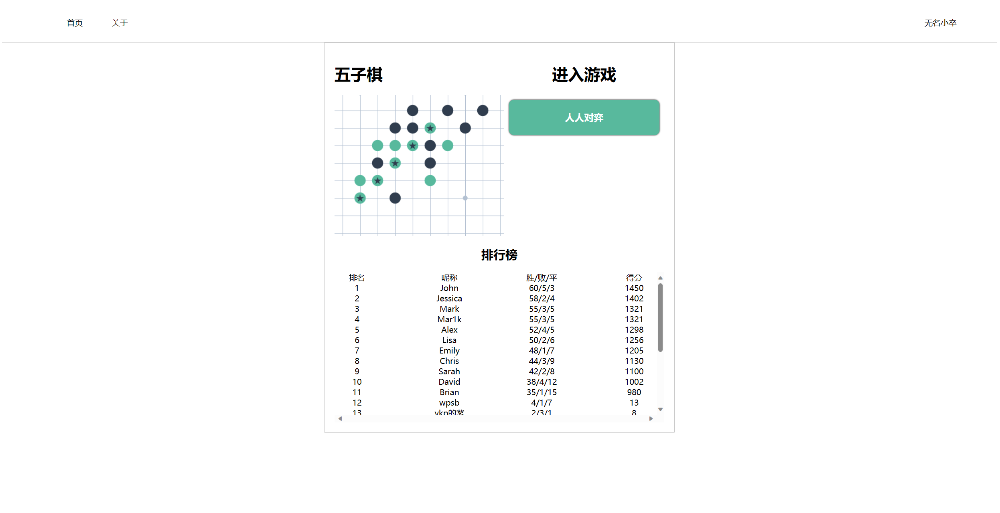
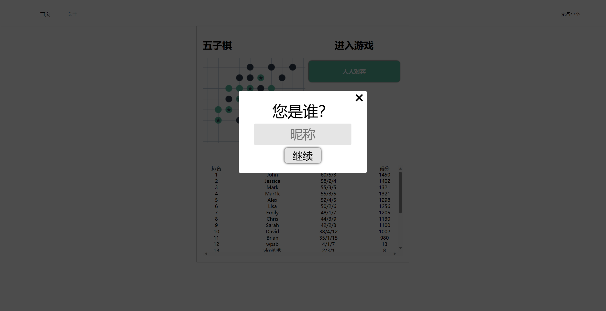
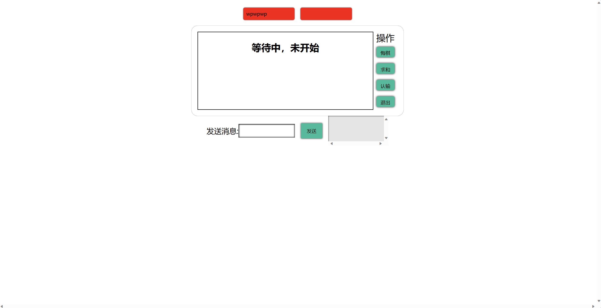
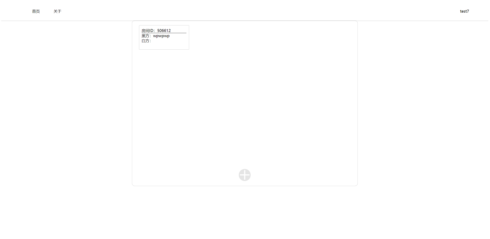
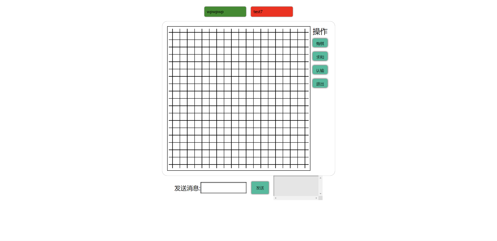
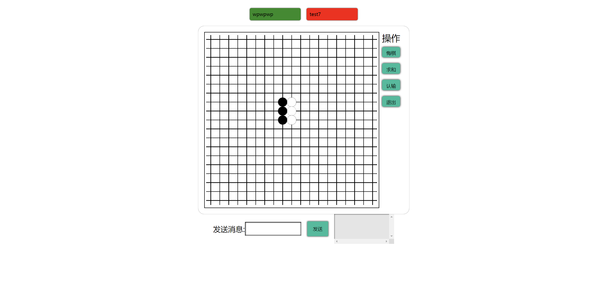
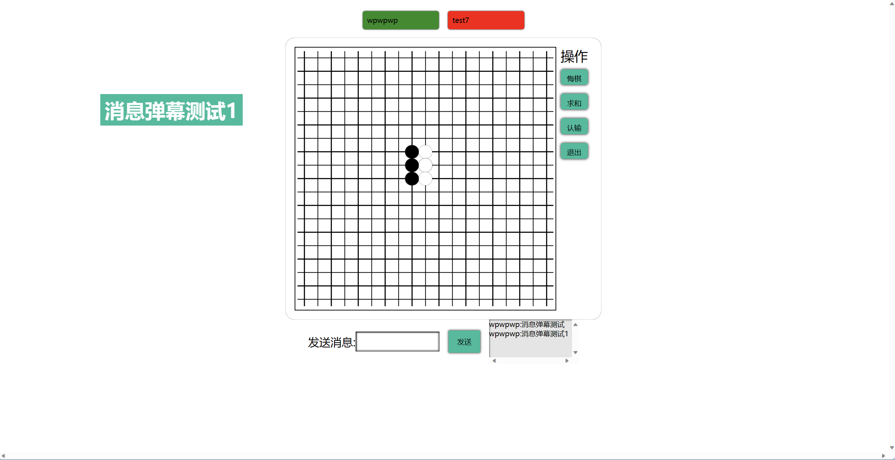
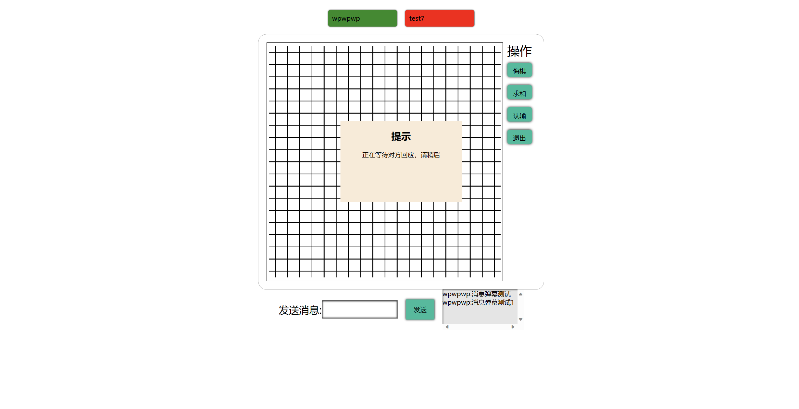
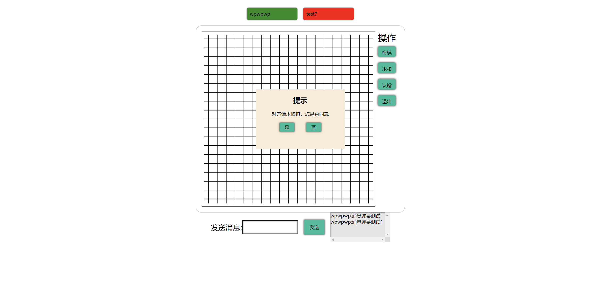
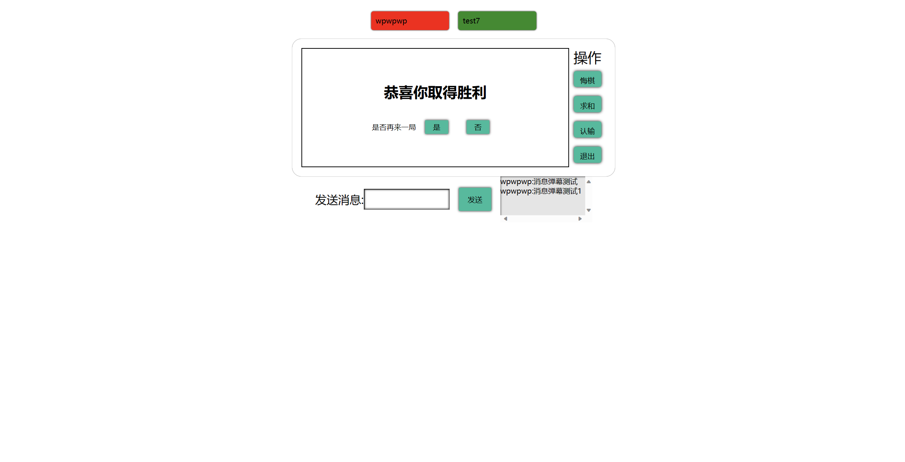

# 五子棋人人对弈 

| 组号 |          |            |        |              |                |      |
| ---- | -------- | ---------- | ------ | ------------ | -------------- | ---- |
| 序号 | 班级     | 学号       | 姓名   | 完成功能简述 | 组内工作完成度 | 成绩 |
| 1    | 数据2201 | 2022040179 | 杨焜鹏 | 前端         |                |      |
| 2    | 数据2201 |            |        |              |                |      |
| 3    | 数据2201 |            |        |              |                |      |


## 一、功能描述

### 1.1 实现功能

- 实时人人对弈：允许两名玩家通过浏览器进行五子棋游戏。
  - 下棋对弈
  - 悔棋
  - 求和
  - 认输
- 实时通信：提供玩家间的实时聊天功能。
- 游戏积分排行：根据玩家对局的精彩程度进行赋分并进行排行

### 1.2 项目开发的环境
#### 前端
- **HTML**: 用于构建网页结构和内容，包括定义页面元素、文本、图像等。

- **JavaScript**: 在该项目中，JavaScript被用于处理用户点击事件、实现游戏逻辑，并与后端进行通信。

- **CSS**: 层叠样式表，用于设计和美化网页样式，包括布局、颜色、字体等方面的呈现。

#### 后端
- **Python**: 在该项目中，Python被用作后端开发语言，负责处理游戏逻辑、用户请求以及与前端通信。
- **Flask框架**: Flask是一个轻量级的Web应用框架，基于Werkzeug工具箱和Jinja2模板引擎。它提供了简单易用的方式来构建Web应用程序，并且具有良好的扩展性。在该项目中，Flask框架被使用来搭建后端服务，并处理前端发起的请求。

## 二、总体结构

### 2.1 文件清单
```
project_folder/
|__ static/
|   |__ js/
|       |__ index.js
|       |__ gamePvP.js
|       |__ gamePvE.js
|       |__ roomList.js
|   |__ style/
|       |__ board.css
|       |__ gamePVE.css
|       |__ gamePvP.css
|       |__ index.css
|       |__ nav.css
|       |__ roomList.css
|   |__ music/
|       |__ failChess.mp3
|       |__ failedGame.mp3
|       |__ winGame.mp3

|__ templates/
|   |__ index.html
|   |__ gamePvE.html
|   |__ gamePvP.html
|   |__ roomList.html
|__ app.py
|__ appInit.py
|__ shareData.py
|__ checkLine.py
|__ chessManul.json
|__ userData.json
```

### 2.2 系统功能结构图
#### HTML 文件
- **index.html**: 主页，用于展示网站的主要内容和导航。
- **gamePvE.html**: 人机对战页面，用于展示人机对战的游戏界面。
- **gamePvP.html**: 人人对战页面，用于展示两个玩家之间的游戏界面。
- **roomList.html**: 房间列表页面，用于展示当前可加入的游戏房间列表。

#### CSS 文件
- **index.css**: 主页样式表。
- **roomList.css**: 房间列表页面样式表。
- **board.css**: 五子棋棋盘样式表。
- **nav.css**: 导航栏样式表。
- **gamePvP.css**: 人人对战页面样式表。
- **gamePVE.css**: 人机对战页面样式表。

#### JavaScript 文件
- **index.js**: 主页相关的前端逻辑处理和与后端通信。
- **gamePvP.js**: 人人对战页面相关的前端逻辑处理和与后端通信。
- **gamePvE.js**: 人机对战页面相关的前端逻辑处理和与后端通信。
- **roomList.js**: 房间列表页面相关的前端逻辑处理和与后端通信。

#### Python 文件
- **app.py**: 后端主要逻辑处理和路由定义。
- **appInit.py**: 应用初始化脚本，包括数据库连接等初始化操作。
- **shareData.py**: 共享数据模块，用于存储全局共享数据或状态信息。
- **checkLine.py**: 检查五子棋胜负模块，包括判断水平、垂直、斜线方向上是否有五子连珠的检查函数。
  
#### 其他文件
 - **chessManual.json**：存储五子棋开局库信息等数据。 
 - **userData.json**：存储用户信息数据。 

### 2.3 系统总流程图

(流程图描述系统整体运行流程，标明每个模块的文件名)

## 三、详细设计

### 3.1数据结构

- 用户信息的数据结构

```json
{
  "userID": "345678",
  "win": 60,
  "fail": 3,
  "peace": 5,
  "score": 1450,
  "userName": "John",
  "rank": 1
}
```

- 房间信息数据结构

```json
{
	"roomID":"666666", //房间id
	"player1":"123455", // 玩家1的id
	"player2":"123456", // 玩家2的id
	"player1_name":"mark", // 玩家1的名字
	"player2_name":"john" //玩家2的名字
}
```

- 游戏棋盘数据结构
  - 19X19 的 二维数组
  - 0 代表落子
  - 1 代表玩家1（黑棋）落子
  - 2 代表玩家2 （白棋）落子
- 完


### 3.2各模块设计

#### 棋盘设计

##### 设计思路：

**HTML 结构：**

通过 HTML 创建一个主容器 div，其中包含一个 div 元素用于显示棋盘格子的容器，并在其中放置四种类型的格子：黑子、白子、空格、和一个带有红色边框的入口格子

**CSS 样式：**

使用 CSS 设置整体布局，包括主容器的样式、棋盘格子容器的样式以及四种不同类型的格子的样式。
利用 Flex 布局实现水平排列，设定固定宽度和边框，以及一些样式效果如阴影、圆角等。
定义不同类型格子的样式，包括黑子、白子、空格和入口格子。

**JavaScript 逻辑：**

定义一个二维数组 boardData 作为棋盘的数据表示，初始化为一个空白棋盘。
创建 InitBoard 函数用于初始化棋盘数组。
创建 RenderBoard 函数用于渲染棋盘，根据 boardData 数组的值选择合适的样式来显示格子。
为每个格子添加点击事件，调用 chooseBlock 函数。

##### 代码：


- HTML

```html
<div id="main"> 
    <div id="boardPad">
        <div class="cell-black cell"></div>
        <div class="cell-white cell"></div>
        <div class="cell-null cell"></div>
        <div class="cell-enter cell"></div>
    </div>
</div>
```

- CSS

```css

#main {
    display: flex;
    flex-direction: row;
    border-radius: 20px;
    padding: 20px;
    box-shadow: 0 0 1px rgba(0, 0, 0.5);
}

#boardPad {
    display: flex;
    flex-direction: row;
    flex-wrap: wrap;
    width: 580px;
    border: solid 2px black;
    justify-content: center;
    padding-top: 8px;
    padding-bottom: 8px;
}

.cell-black {
    width: 30px;
    height: 30px;
    background-color: black;
    border-radius: 100%;
    box-shadow: 0 0 2px rgba(0, 0, 0.8);
}

.cell-white {
    width: 30px;
    height: 30px;
    background-color: white;
    border-radius: 100%;
    box-shadow: 0 0 2px rgba(0, 0, 0.8);
}

.cell-null {
    width: 30px;
    height: 30px;
    position: relative;
}

.cell-null::after {
    content: "";
    position: absolute;
    width: 100%;
    height: 2px;
    top: 50%;
    left: 0;
    transform: translateY(-50%);
    background-color: black;
}

.cell-null::before {
    content: "";
    position: absolute;
    background-color: black;
    width: 2px;
    height: 100%;
    top: 0;
    left: 50%;
    transform: translateX(-50%);
}

.cell-enter {
    position: relative;
    width: 26px;
    height: 26px;
    border: solid 2px red;
}

.cell-enter::after {
    content: "";
    position: absolute;
    width: 100%;
    height: 2px;
    top: 50%;
    left: 0;
    transform: translateY(-50%);
    background-color: black;
}

.cell-enter::before {
    content: "";
    position: absolute;
    background-color: black;
    width: 2px;
    height: 100%;
    top: 0;
    left: 50%;
    transform: translateX(-50%);
}
```

- JavaScript

```javascript
var boardData = [[]]
function InitBoard() {
    //初始化棋盘数组
    for (var i = 0; i < 19; i++) {
        boardData[i] = [];
        for (var j = 0; j < 19; j++) {
            boardData[i][j] = 0;
        }
    }
}
//渲染棋盘
function RenderBoard() {
    const boardElement = document.getElementById('boardPad');
    boardElement.innerHTML = '';
    for (var i = 0; i < 19; i++) {
        for (var j = 0; j < 19; j++) {
            const cell = document.createElement('div');
            cell.dataset.row = i;
            cell.dataset.col = j;
            if (boardData[i][j] == 0) {		//0渲染空格
                cell.className = 'cell-null';
            } else if (boardData[i][j] == 1) {		//1渲染黑棋
                cell.className = 'cell-black';
            } else if (boardData[i][j] == 2) {		//2渲染白棋
                cell.className = 'cell-white';
            }
						//为每个棋子添加点击事件
            cell.addEventListener('click', chooseBlock);
            boardElement.appendChild(cell);
        }
    }
}
```


#### 对局逻辑

#####  创建房间逻辑

###### 设计思路

玩家进入房间列表页面后，点击新建房间button，向服务器发送请求新建房间，服务器收到请求后向所有客户端广播roomList列表并刷新页面

###### 代码

+ 前端

```js
//向服务器发送新建房间请求
function createRoom() {
    const userID = localStorage.getItem('user_id').toString();
    data = {
        'userID': userID,
        userName: userName
    }
    socket.emit("newRoom", data);
}
```

+ 后端

```python
@socketio.on('newRoom')
def newRoom(data):  
    player1 = data['userID']
    player2 = ''
    playerNum = ''
    moves=[]
    isAgainGame = []
    player1_name = data['userName']
    player2_name = ''
    roomID = str(random.randint(100000, 999999))
    shareData.rooms.add_room(roomID,player1,player2,playerNum,moves,isAgainGame,player1_name,player2_name)
    emit('room_created', {'player1': player1_name, 'player2': player2_name, 'roomID': roomID, 'state': 0, "pid1":player1,"pid2":player2},broadcast=True)
```


##### 加入房间逻辑

###### 设计思路

玩家在房间列表页面可以实时看到当前的所有房间，可选择有空位的房间加入，当一个房间满两人之后，游戏自动开始

###### 代码

+ 前端

```javascript
document.addEventListener("DOMContentLoaded", function () {
    socketio.emit("joinRoom", data)

    socketio.on("joinRoom_success" + roomID, (res) => {
        console.log(res)
        if (userID == res.player1) {
            player = 1
            document.getElementById("palyer1name").innerText = res.userNames[0]
            document.getElementById("palyer2name").innerText = res.userNames[1]
        } else if (userID = res.player2) {
            player = 2
            document.getElementById("palyer1name").innerText = res.userNames[0]
            document.getElementById("palyer2name").innerText = res.userNames[1]
        }
        console.log(player)
        if (res.state == 1) {
            isStart = true
            RenderBoard()
            if (player == 1) {
                isPlay = 1
            }
            StatusChecking()
            console.log("isPlay:" + isPlay)
            IsRepentance()
            SubscriptPeace()
            SubscriptAdmitDefeat()
            ClientReceiveMsg()
            ShowUserList()
        } else {
            isStart = false
            document.getElementById('boardPad').innerHTML = "<h1>等待中，未开始</h1>";
        }


    })
});
```


+ 后端

```python
@socketio.on('joinRoom')
def joinRoom(data):
    player = data['userID'] #请求加入房间者的userID
    roomID = data['roomID']
    current = shareData.rooms.get_room(roomID)
    userData = GetUsersInfo()
    if current is not None:
        if current.playerNum == '':
            current.playerNum += '1'
            # 新建房间时已进行player1的赋值
            # 根据userID获取玩家名字
            for user in userData:
                if user['userID'] == player:
                    current.player1_name = user['userName']
            userNames=[current.player1_name,""]
            emit('joinRoom_success'+roomID, {'player1': player, 'player2': '', 'room': roomID, 'state': 0, 'userNames':userNames}, broadcast=True)
            emit('userList'+roomID, {'player1': player, 'player2': '', 'room': roomID, 'state': 0, 'userNames':userNames}, broadcast=True)
        elif current.playerNum == '1':
            if player != current.player1:
                current.player2 = player
                current.playerNum += '1'
                for user in userData:
                    if user['userID'] == player:
                        current.player2_name = user['userName']
                print(current.player1_name,current.player2_name)
                userNames=[current.player1_name,current.player2_name]
                
                
                emit('joinRoom_success'+roomID, {'player1': current.player1, 'player2': player, 'room': roomID, 'state': 1, 'userNames':userNames}, broadcast=True)
                emit('userList'+roomID, {'player1': player, 'player2': '', 'room': roomID, 'state': 0, 'userNames':userNames}, broadcast=True)
            else:
                for user in userData:
                    if user['userID'] == player:
                        current.player1_name = user['userName']
                userNames=[current.player1_name,""]
                emit('joinRoom_success'+roomID, {'player1': current.player1, 'player2': '', 'room': roomID, 'state': 0,'userNames':userNames}, broadcast=True)
                emit('userList'+roomID, {'player1': player, 'player2': '', 'room': roomID, 'state': 0, 'userNames':userNames}, broadcast=True)
        else:
            emit('joinRoom_fail', {'room': roomID})
    else:
        print('Cant find the room!'+roomID)
```


##### 双方落子逻辑

###### 设计思路

依托技术：SocketIO

Player1落子，然后将落子坐标传给服务器，服务器广播给房间内的玩家，接收到落子信息后更新棋盘信息并渲染棋盘。

###### 代码

- 前端

```javascript
//落子
function chooseBlock(event) {
    if (isPlay == 0) {
        console.log("当前不是您落子")
    } else {
        const row = parseInt(event.target.dataset.row);
        const col = parseInt(event.target.dataset.col);
        if (boardData[row][col] == 0) {
            //判断如果两次点击为同一个坐标这进行落子，
            //否则清除上一次的样式，更新当前坐标样式
            if (lastBlock.col == col && lastBlock.row == row) {
                //落子
                handleCellClick(event)
            } else {
                //删除上一次方格的样式
                if (lastBlock.lastEvent != null) {
                    lastBlock.lastEvent.target.classList.remove("cell-enter")
                }
                event.target.classList.add("cell-enter")
                lastBlock.col = col
                lastBlock.row = row
                lastBlock.lastEvent = event
            }
            console.log(lastBlock)
        } else {
            console.log("您不能在已落子的地方落子")
        }

    }
}
//操作数组并与服务器进行通信
function handleCellClick(event) {
    const row = parseInt(event.target.dataset.row);
    const col = parseInt(event.target.dataset.col);
    console.log(event)
    //判断黑白方
    if (player == 1) {

        boardData[row][col] = 1
        PlayMusic("failChess")

    } else if (player == 2) {

        boardData[row][col] = 2
        PlayMusic("failChess")

    }
    var data = {
        roomID: roomID,
        player: player,
        row: row,
        col: col,
    }
    // sockeio通信
    socketio.emit("fallChess", data)

    isPlay = 0

}
/***************************************************分割线*************************************************/


document.addEventListener("DOMContentLoaded", function () {
		//仅展示该该功能的代码，不是该函数下的全部代码
  
    const LocalUrl = "http://127.0.0.1:5000"
    socketio = io(LocalUrl);
    socketio.on("fallChess_success" + roomID, res1 => {
          console.log(res1.shareData)
          var row = res1.row;
          var col = res1.col;

          var playerType = res1.player
          if (playerType == 1 && player == 2) {
              isPlay = 1;
          } else if (playerType == 2 && player == 1) {
              isPlay = 1;
          } else if (playerType == 1 && player == 1) {
              isPlay = 0;
          } else if (playerType == 2 && player == 2) {
              isPlay = 0;
          }
          StatusChecking();
          boardData[row][col] = playerType
          RenderBoard();

          chessManual = {
              "userType": playerType,
              "pos": {
                  "x": col, "y": row  //x,y坐标和行列是相反的
              }
          }
         chessManuals.push(chessManual)
    }
});

```

- 后端

```python
@socketio.on('fallChess')
def fallChess(data):
    roomID = data['roomID']
    col = data['col']
    row = data['row']
    player = data['player']
    current = shareData.rooms.get_room(roomID)
    current.moves.append([row,col,player])
    emit('fallChess_success'+roomID, {'col': col, 'row': row, 'player': player,'roomID':roomID},broadcast=True)

```

##### 胜利判定

###### 设计思路

我们的胜利判定是在后端服务器上进行的，思路就是每落一次子，检测一下落子位置的四个方向是否会有连续五颗相同棋子。

###### 代码

```python
def check_win(player, row, col, board_data):
    
    # 检查水平方向
    count = 0
    for i in range(col - 4, col + 5):
        if 0 <= i < 19 and board_data[row][i] == player:
            count += 1
            if count == 5:
                return True
        else:
            count = 0

    # 检查垂直方向
    count = 0
    for i in range(row - 4, row + 5):
        if 0 <= i < 19 and board_data[i][col] == player:
            count += 1
            if count == 5:
                return True
        else:
            count = 0

    # 检查主对角线
    count = 0
    for i, j in zip(range(row - 4, row + 5), range(col - 4, col + 5)):
        if 0 <= i < 19 and 0 <= j < 19 and board_data[i][j] == player:
            count += 1
            if count == 5:
                return True
        else:
            count = 0

    # 检查副对角线
    count = 0
    for i, j in zip(range(row - 4, row + 5), range(col + 4, col - 5, -1)):
        if 0 <= i < 19 and 0 <= j < 19 and board_data[i][j] == player:
            count += 1
            if count == 5:
                return True
        else:
            count = 0

    return False

```


##### 悔棋

###### **设计思路**

玩家A向服务器通信表示要悔棋，服务器广播房间内的玩家，玩家A则等待回应，玩家B则回应是否同意悔棋，如果同意则向服务器发送同意悔棋，然后广播悔棋操作。撤回到玩家A的上一步。

###### 玩家A发起请求在房间内广播代码

```python
@socketio.on('repentance')
def repentance(data):
    roomID = data['roomID']
    player = data['player']
    emit('IsRepentance'+roomID,{"roomID":roomID,"player":player},broadcast=True)
```

###### 玩家B是否接受悔棋代码

```python
@socketio.on('AcceptRepentance')
def AcceptRepentance(data):
    roomID = data['roomID']
    player = data['player']
    isAccept = data['isAccept']
    current = shareData.rooms.get_room(roomID)
    current.moves.pop()
    current.moves.pop()
    if(isAccept == "1"):
        emit("RepentanceResult"+roomID,{"result":1,"moves":current.moves},broadcast=True)
    else:
        emit("RepentanceResult"+roomID,{"result":0},broadcast=True)
```


##### 认输

###### 设计思路

玩家A向服务器通信表示要认输，服务器收到请求后，向房间内广播有玩家认输，游戏结束。

###### 代码

```python
@socketio.on('AdmitDefeat')
def AdmitDefeat(data):
    roomID = data['roomID']
    player = data['player']
    emit("AdmitDefeat"+roomID,{"player":player},broadcast=True)
```


##### 求和

###### 设计思路

服务器通信流程同悔棋，玩家A向服务器通信表示要和棋，服务器广播房间内的玩家，玩家A则等待回应，玩家B则回应是否同意和棋，如果同意则向服务器发送同意和棋，然后服务器广播和棋操作，游戏结束

###### 玩家A向服务器发起求和请求代码

```python
@socketio.on("Peace")
def Peace(data):
    roomID = data['roomID']
    player = data['player']
    emit('Peace'+roomID,{"roomID":roomID,"player":player},broadcast=True)
```

###### 玩家B回应服务器是否同意求和代码

```python
@socketio.on('AcceptPeace')
def AcceptPeace(data):
    print(data)
    roomID = data['roomID']
    player = data['player']
    isAccept = data['isAccept']
    
    if(isAccept == "1"):
        current = shareData.rooms.get_room(roomID)
        Score("Peace",player,roomID)
        emit("AcceptPeace"+roomID,{"result":1},broadcast=True)
    else:
        emit("AcceptPeace"+roomID,{"result":0},broadcast=True)
```

#### 客户端断开连接设计

##### 设计思路

玩家joinRoom时，以sid为key，userID+roomID为value，添加进shareData的clients字典中

当玩家关闭网页时，WebSocketIO库自动发送消息给后端，后端收到disconnect消息，获取客户端的sid，根据sid查找所对应的userID和roomID，然后执行leaveRoom函数

该功能避免房间列表中存在无用假房间

##### 代码

```python
client_id = request.sid
shareData.clients[client_id] = player+roomID
```

```python
@socketio.on('disconnect')
def handle_disconnect():
    cilent_id = request.sid
    print(cilent_id)
    id = shareData.clients.get(cilent_id)
    if id:
        data={
            'roomID':id[6:],
            'userID':id[:6]
        }
        leaveRoom(data)
    else:
        print('Can not find!')
```


### 3.3后端数据处理

#### 游戏对局数据处理

##### 设计思路

相比于直接使用MySQL等数据库，使用python链表无疑更加能够体现对于本门课程知识的应用

于是，在本项目中，我们使用了python链表来存放有关于游戏对局的信息

我们定义了两个类，Room和RoomList，下面详细介绍这两个类

###### Room类

Room类表示一个房间对象，拥有一系列属性来描述房间的特征

+ `roomID`:roomID是房间独一无二的ID
+ `player1和player2`:player用来表示玩家的ID，其值为userID字符串
+ `playerNum`:playerNum是用来表示房间内玩家的数量
+ `moves`:moves用来记录玩家的棋步
+ `player_name`:player_name用来记录玩家的昵称

类代码如下

```python
class Room:
    def __init__(self, roomID, player1, player2, playerNum, moves, isAgainGame, player1_name, player2_name):
        self.roomID = roomID
        self.player1 = player1
        self.player2 = player2
        self.playerNum = playerNum
        self.isAgainGame = isAgainGame
        self.player1_name = player1_name
        self.player2_name = player2_name
        self.moves = moves
        self.next = None
```


###### RoomList类

RoomList类中包含一些对于房间链表的操作

+ `init`:init方法用于初始化房间列表
+ `add_room`:add_room方法用于新建一个房间，将新房间添加到链表末尾
+ `get_room`:get_room方法可以根据roomID遍历查找房间，获取房间内的各种信息
+ `delete_room`:delete_room方法用于游戏结束是删除房间节点，并将对局信息保存

类代码如下

```python
class RoomList:
    def __init__(self):
        # 初始化房间列表，头部节点为None
        self.head = None

    def add_room(self, roomID, player1, player2 , playerNum, moves, isAgainGame, palyer1_name, player2_name):
        # 创建一个新的房间对象
        new_room = Room(roomID, player1, player2 , playerNum, moves, isAgainGame, palyer1_name, player2_name)
        if self.head is None:
            # 如果列表为空，将新房间设置为头部节点
            print('0')
            self.head = new_room
        else:
            current = self.head
            while current.next is not None:
                # 遍历列表，找到最后一个节点
                current = current.next
            # 将新房间连接到最后一个节点的后面
            print('1')
            current.next = new_room


    def get_room(self, roomID):
        current = self.head
        while current is not None:
            # 遍历列表，查找具有特定房间ID的房间
            if current.roomID == roomID:
                return current  # 如果找到匹配的房间，则返回该房间对象
            current = current.next
        return None  # 如果未找到匹配的房间，则返回None
    

    def delete_room(self,roomID):
        print('执行delete_room')
        current = self.head
        prev = None
        while current is not None:
            if current.roomID == roomID:
                # 保存对局信息到chessManual.json文件
                data = {
                    'roomID': current.roomID,
                    'player1': current.player1,
                    'player2': current.player2,
                    'moves': current.moves,
                    'time': time.strftime("%Y-%m-%d %H:%M:%S", time.localtime())
                }
                with open('chessManual.json', 'a') as file:
                    json.dump(data, file, indent=4)
                    file.write('\n')
                # 删除节点
                if prev is None:
                    # 如果要删除的房间是头部节点，更新头部节点为下一个节点
                    rooms.head = current.next
                else:
                    # 将前一个节点的next指针连接到被删除节点的next指针上，绕过被删除节点
                    prev.next = current.next
                break
            prev = current
            current = current.next
```


## 四、程序的过程展示

### 网站首页展示玩家的积分排名



### 首次点击人人对弈进入游戏需要设置昵称



### 输入昵称后进入房间列表页面


### 点击加号新建房间自动跳转进入房间页面等待另一名玩家



### 其他玩家此时进入房间列表页面可以看见现存的房间



### 点击加入房间游戏自动开始



### 游戏界面有多中操作，包括发送消息，悔棋、求和、认输、离开房间









### 游戏结束后可以选择离开房间或者再来一局



## 五、软件的辅助说明
### 项目运行预览

将项目clone下来之后，首先配置后端环境，执行如下命令安装项目依赖

```bash
pip install -r requirements.txt
```

然后运行app.py程序，程序默认在http://localhost:5000运行，注意防火墙设置

然后打开浏览器进入http://localhost:5000即可查看网页运行
### 项目优点
本项目基于前端基础三件套、和Python的Flask作为后端框架，从开发上来说，开发难度较低，项目拓展性强。从用户使用角度来说，用户体验良好，游戏运行稳定。
### 项目缺点
本项目在运行上存在一些bug。如：
- 结算音效的叠加播放
- 没有做页面刷新的逻辑处理

## 六、课程设计结论

## 七、参考文献（参考网站）

[Flask官网文档](https://dormousehole.readthedocs.io/en/latest/index.html)

[Flask 中文文档](https://flask.github.net.cn/)


## 八、附录——提交文档清单

